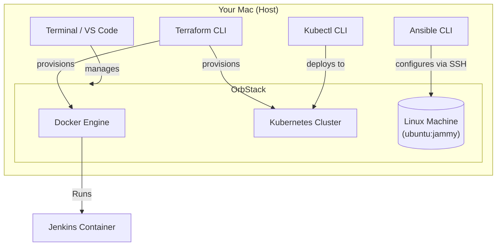

# Architecture Overview

This **Local DevOps Playground** is designed to run entirely on your local machine using **OrbStack**. OrbStack creates a unified environment for containers, Kubernetes, and Linux virtual machines, significantly simplifying the stack compared to traditional setups.

## High-Level Documentation

**OrbStack** replaces Docker Desktop, VirtualBox, and Vagrant. It handles:
1.  **Docker Engine**: Runs containers (Jenkins, Web servers).
2.  **Kubernetes**: Built-in K8s cluster.
3.  **Linux Machines**: Lightweight Linux VMs that integrate seamlessly with your Mac's filesystem and network.

## How It Works

### 1. The Linux Server (OrbStack Machine)
- **Goal:** A raw Linux playground.
- **How:** Run `orb create ubuntu:22.04 playground-vm`.
- **Magic:** You can access it directly via SSH or `orb -m playground-vm`. It shares your network, so `localhost` works bidirectionally!

### 2. Infrastructure as Code (Terraform)
- **Goal:** Define your local infrastructure in code.
- **How:** We use Terraform to define Docker containers and Kubernetes resources.
- **Example:** Instead of running `docker run`, you write a `main.tf` file defining your Jenkins server, and Terraform talks to the OrbStack Docker engine to create it.

### 3. Kubernetes (OrbStack K8s)
- **Goal:** Production-grade container orchestration.
- **How:** Enable Kubernetes in OrbStack settings.
- **Interaction:** `kubectl` is automatically configured to talk to your OrbStack cluster.

### 4. Configuration Management (Ansible)
- **Goal:** Configure servers automatically.
- **Interaction:** You point Ansible at your OrbStack Linux machine. Since OrbStack machines are easily accessible, the inventory setup is trivial.
