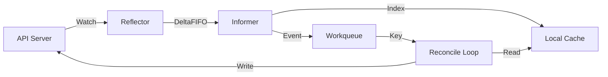

# Kubernetes Internals Deep Dive

## Table of Contents
1.  [The Controller Pattern & Informers](#the-controller-pattern--informers)
2.  [API Server Request Lifecycle](#api-server-request-lifecycle)
3.  [Etcd: The Brain (Storage Engine)](#etcd-the-brain-storage-engine)
4.  [Scheduler: Priorities & Predicates](#scheduler-priorities--predicates)
5.  [Kubelet Architecture](#kubelet-architecture)
6.  [Networking: CNI & Packet Flow](#networking-cni--packet-flow)
7.  [Storage: CSI & Volume Binding](#storage-csi--volume-binding)

---

## The Controller Pattern & Informers

Kubernetes is a declarative system driven by **Control Loops**. The core logic is:
```go
for {
    desired := getDesiredState()
    current := getCurrentState()
    if desired != current {
        makeChanges(current, desired)
    }
}
```

### The Client-Go Library: Under the Hood

High-performance controllers don't poll the API server (that would kill it). They use **informers**.

1.  **Reflector**: Watches the API Server (gRPC stream). Puts objects into a **DeltaFIFO** queue.
    -   *Events*: `Add`, `Update`, `Delete`.
2.  **Informer**: Popped from DeltaFIFO, saved to **Local Store** (Cache).
3.  **Indexer**: Indexes objects (e.g., "Get all pods by node name").
4.  **Workqueue**: If an object changes, its **Key** (`namespace/name`) is pushed here.
5.  **Reconcile()**: The worker pops the Key. It **NEVER** reads from API Server; it reads from the **Local Store** (Lister).

**Visual Flow:**


---

## API Server Request Lifecycle

What happens when you run `kubectl apply -f pod.yaml`?

### 1. Authentication (Who are you?)
The HTTP request hits the chain of authenticators:
-   **x509 Client Certs**: Checks CA signature (Common for Kubelet/Admins).
-   **Bearer Token**: Service Accounts (JWT).
-   **OIDC**: Google/AWS SSO.

### 2. Authorization (Can you do this?)
Checks the `SubjectAccessReview`.
-   **RBAC**: Role (`create` verb on `pods` resource).
-   **ABAC**: Old attribute-based files.
-   **NodeRestriction**: Stops compromised nodes from modifying other nodes' pods.

### 3. Mutating Admission Controllers
Webhooks that *change* the object before saving.
-   **DefaultStorageClass**: Adds `storageClassName: standard`.
-   **ServiceAccount**: Injects default token.
-   **Istio Sidecar Injector**: Adds the Envoy container.

### 4. Validating Admission Controllers
Webhooks that *reject* the object.
-   **LimitRanger**: "You asked for 100 CPU cores? Denied."
-   **ResourceQuota**: "Namespace is out of memory."
-   **PodSecurityPolicy** (Deprecated) / **Pod Security Standards**.

### 5. Storage (etcd)
The object is serialized to Protocol Buffers (proto) and written to `/registry/pods/default/mypod`.

---

## Etcd: The Brain (Storage Engine)

Etcd is a consistent, distributed key-value store using the B+ tree structure.

### The Raft Consensus Algorithm
-   **Log Replication**: Everything is an append-only log entry.
-   **Term**: Logical clock. Higher term = newer leader.
-   **Heartbeats**: Leader pings followers every 100ms. If missed (election timeout ~150-300ms), new election starts.

### Storage Hierarchy (MVCC)
Etcd keeps *versions* of keys.
-   `Rev 1`: `key=A, val=1`
-   `Rev 2`: `key=A, val=2`

**Compaction**: Older versions are cleared periodically (`etcd --auto-compaction-retention`).
**Defrag**: Frees up whitespace in the `db` file (boltdb). Without defrag, db size grows indefinitely even if you delete keys.

### Failure Modes
-   **Split Brain**: 5 nodes split into 3 and 2. The 3 continue (quorum). The 2 become Read-Only.
-   **Disk Latency**: If `fsync` takes >100ms, heartbeats fail, leader flaps. **Always use SSD for etcd.**

---

## Scheduler: Priorities & Predicates

The generic scheduler has a 2-step process.

### 1. Filtering (Predicates) - "Can it run here?"
Hard constraints.
-   `PodFitsResources`: Node free memory > Pod request?
-   `MatchNodeSelector`: Labels match?
-   `NoDiskConflict`: Volume available?
-   `TaintToleration`: Does pod tolerate node taint?

### 2. Scoring (Priorities) - "Should it run here?"
Soft constraints (0-100 score).
-   `LeastRequestedPriority`: Spread pods to idle nodes (Good for reliability).
-   `MostRequestedPriority`: Binpack pods to full nodes (Good for cost/autoscaling).
-   `ImageLocalityPriority`: Node already has the 500MB image? (+Score).

---

## Kubelet Architecture

The Kubelet is arguably more complex than the API server because it deals with the messy reality of Linux.

### The PLEG (Pod Lifecycle Event Generator)
The Kubelet needs to know if a container died.
-   **Old way**: Poll runtime every 1s. (High CPU).
-   **New way (PLEG)**: Listens to event stream from Runtime (CRI).

**"Pleg is not healthy" error**:
Means the Kubelet is stuck. Usually because:
1.  Container runtime (Docker/Containerd) is hung.
2.  System is OOM.
3.  Command `runc` timed out talking to Kernel.

### Garbage Collection
-   **ImageGC**: Deletes unused images when disk > 85%.
-   **ContainerGC**: Removes dead containers.

---

## Networking: CNI & Packet Flow

### 1. Setup Phase (CNI)
When a pod starts:
1.  Kubelet pauses (CreateSandbox).
2.  Calls CNI Plugin binary (binary execution, not daemon).
    -   `CNI_COMMAND=ADD`
    -   `CNI_NETNS=/var/run/netns/...`
3.  Plugin creates **veth pair**.
4.  Plugin calls **IPAM** (IP Address Management) plugin (mostly `host-local`) to get an IP.

### 2. Service Proxying (IPVS vs Iptables)
**Iptables Mode**:
-   Kube-proxy writes HUGE list of `DNAT` rules.
-   O(n) performance. 5000 services = slow updates.
-   Packet routing involves linear scan of rules.

**IPVS Mode**:
-   Uses Linux Kernel's IP Virtual Server (L4 load balancer).
-   O(1) performance using Hash tables.
-   Supports more algorithms (Least Conn, Round Robin).

### 3. DNS (CoreDNS)
Running as a Deployment.
-   Watches Services/Endpoints.
-   Updates internal memory.
-   **ndots:5 issue**: By default, Linux resolver tries 5 search domains.
    -   Lookup: `google.com`
    -   Tries: `google.com.default.svc.cluster.local`, `google.com.svc.cluster.local`... x5
    -   **Fix**: Add strict FQDN (`.`) or tune `ndots` in app config.

---

## Storage: CSI & Volume Binding

### The Problem of "Attach/Detach"
Cloud Volumes (EBS/PD) can only attach to one node.

### The Flow
1.  **PVC Created**: User asks for 10GB.
2.  **StorageClass**: Defines "Wait for Consumer" (Lazy binding).
3.  **Pod Scheduled**: To Node A.
4.  **Binder**: Updates PVC to bind to a specific PV (provisioned now).
5.  **Attacher (Controller)**: Calls Cloud API "Attach Volume ID X to Instance Y".
6.  **Mounter (Kubelet)**:
    -   Formats disk (ext4/xfs).
    -   Mounts to global path: `/var/lib/kubelet/plugins/...`
    -   Bind mounts to pod: `/var/lib/kubelet/pods/<ID>/volumes/...`

**Stuck Mounting?**
-   Usually "Multi-Attach Error": Volume is still attached to old Dead Node.
-   Fix: Force detach in Cloud Console or wait for Layout timeout (6mins).
