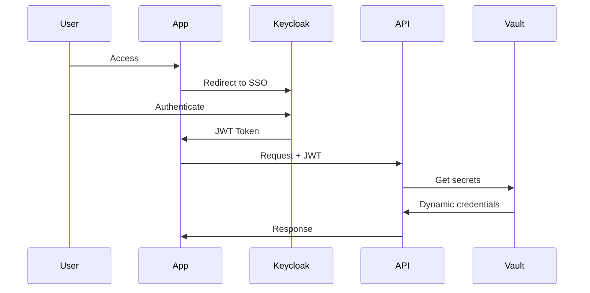

# Zero Trust Security Platform

Enterprise-grade Zero Trust security implementation with service mesh, mTLS, OIDC authentication, secrets management, and comprehensive policy enforcement.

## Architecture

```
┌─────────────────────────────────────────────────────────────────────────────────────┐
│                         ZERO TRUST SECURITY PLATFORM                                 │
├─────────────────────────────────────────────────────────────────────────────────────┤
│                                                                                      │
│  ┌───────────────────────────────────────────────────────────────────────────────┐  │
│  │                         IDENTITY LAYER                                         │  │
│  │  ┌─────────────────┐  ┌─────────────────┐  ┌─────────────────────────────────┐│  │
│  │  │    Keycloak     │  │   Dex (OIDC)    │  │         SPIFFE/SPIRE           ││  │
│  │  │  (IdP/SSO)      │  │  (K8s Auth)     │  │  (Workload Identity)            ││  │
│  │  │  SAML/OIDC      │  │  GitHub/Google  │  │  mTLS Certificates              ││  │
│  │  └────────┬────────┘  └────────┬────────┘  └────────────┬────────────────────┘│  │
│  │           └───────────────────┬┴────────────────────────┘                     │  │
│  └───────────────────────────────┼───────────────────────────────────────────────┘  │
│                                  │                                                   │
│  ┌───────────────────────────────┼───────────────────────────────────────────────┐  │
│  │                         SERVICE MESH                                           │  │
│  │  ┌─────────────────────────────────────────────────────────────────────────┐  │  │
│  │  │                         ISTIO                                            │  │  │
│  │  │  ┌─────────────┐  ┌─────────────┐  ┌─────────────┐  ┌─────────────┐    │  │  │
│  │  │  │   Pilot     │  │   Citadel   │  │   Galley    │  │   Envoy     │    │  │  │
│  │  │  │  (Control)  │  │   (mTLS)    │  │  (Config)   │  │  (Sidecar)  │    │  │  │
│  │  │  └─────────────┘  └─────────────┘  └─────────────┘  └─────────────┘    │  │  │
│  │  └─────────────────────────────────────────────────────────────────────────┘  │  │
│  └────────────────────────────────────────────────────────────────────────────────┘  │
│                                                                                      │
│  ┌───────────────────────────────────────────────────────────────────────────────┐  │
│  │                         POLICY ENGINE                                          │  │
│  │  ┌─────────────────┐  ┌─────────────────┐  ┌─────────────────────────────────┐│  │
│  │  │  OPA Gatekeeper │  │   Kyverno       │  │      Falco                       ││  │
│  │  │  (Admission)    │  │  (Policies)     │  │  (Runtime Security)             ││  │
│  │  └─────────────────┘  └─────────────────┘  └─────────────────────────────────┘│  │
│  └───────────────────────────────────────────────────────────────────────────────┘  │
│                                                                                      │
│  ┌───────────────────────────────────────────────────────────────────────────────┐  │
│  │                         SECRETS MANAGEMENT                                     │  │
│  │  ┌─────────────────┐  ┌─────────────────┐  ┌─────────────────────────────────┐│  │
│  │  │   Vault         │  │  External       │  │    Sealed Secrets               ││  │
│  │  │  (Central)      │  │  Secrets Op     │  │   (GitOps Safe)                 ││  │
│  │  └─────────────────┘  └─────────────────┘  └─────────────────────────────────┘│  │
│  └───────────────────────────────────────────────────────────────────────────────┘  │
│                                                                                      │
│  ┌───────────────────────────────────────────────────────────────────────────────┐  │
│  │                         NETWORK SECURITY                                       │  │
│  │  ┌─────────────────┐  ┌─────────────────┐  ┌─────────────────────────────────┐│  │
│  │  │   Cilium        │  │   Calico        │  │     Network Policies            ││  │
│  │  │  (eBPF CNI)     │  │  (CNI)          │  │    (L3/L4/L7)                   ││  │
│  │  └─────────────────┘  └─────────────────┘  └─────────────────────────────────┘│  │
│  └───────────────────────────────────────────────────────────────────────────────┘  │
│                                                                                      │
└─────────────────────────────────────────────────────────────────────────────────────┘
```

## Features

- **Identity Federation** - SAML/OIDC SSO with Keycloak
- **Workload Identity** - SPIFFE/SPIRE for service-to-service auth
- **mTLS Everywhere** - Automatic mutual TLS via Istio
- **Policy Enforcement** - OPA Gatekeeper and Kyverno policies
- **Runtime Security** - Falco for threat detection
- **Secrets Management** - HashiCorp Vault with dynamic secrets
- **Network Segmentation** - Cilium with eBPF-based policies
- **Audit Logging** - Complete audit trail with tamper-proof logs

## Quick Start

```bash
# Deploy to Kubernetes cluster
kubectl apply -k kubernetes/base

# Initialize Vault
./scripts/init-vault.sh

# Configure OIDC
./scripts/configure-oidc.sh

# Deploy sample application
kubectl apply -f examples/sample-app/

# Access:
# - Keycloak: https://sso.example.com
# - Vault: https://vault.example.com
# - Kiali (Istio): https://kiali.example.com
```

## Zero Trust Principles

| Principle | Implementation |
|-----------|----------------|
| Never Trust, Always Verify | mTLS between all services |
| Least Privilege Access | RBAC + fine-grained policies |
| Assume Breach | Runtime threat detection with Falco |
| Verify Explicitly | OIDC/SPIFFE identity verification |
| Secure All Endpoints | Network policies at L3/L4/L7 |

## Directory Structure

```
zero-trust-security/
├── kubernetes/
│   ├── base/                    # Base configurations
│   │   ├── istio/              # Service mesh
│   │   ├── spire/              # Workload identity
│   │   ├── vault/              # Secrets management
│   │   ├── keycloak/           # Identity provider
│   │   ├── opa-gatekeeper/     # Policy engine
│   │   ├── kyverno/            # Policy engine
│   │   ├── falco/              # Runtime security
│   │   └── network-policies/   # Network segmentation
│   └── overlays/               # Environment-specific
│       ├── dev/
│       ├── staging/
│       └── production/
├── policies/
│   ├── opa/                    # OPA Rego policies
│   └── kyverno/                # Kyverno policies
├── terraform/                  # Infrastructure
├── scripts/                    # Setup scripts
└── examples/                   # Sample applications
```

## Authentication Flow



## Compliance Mappings

| Standard | Relevant Controls |
|----------|-------------------|
| SOC 2 | CC6.1, CC6.6, CC6.7 |
| HIPAA | 164.312(a), 164.312(d) |
| PCI DSS | 8.2, 8.3, 9.4 |
| NIST 800-53 | AC-2, AC-3, AU-2, SC-8 |
